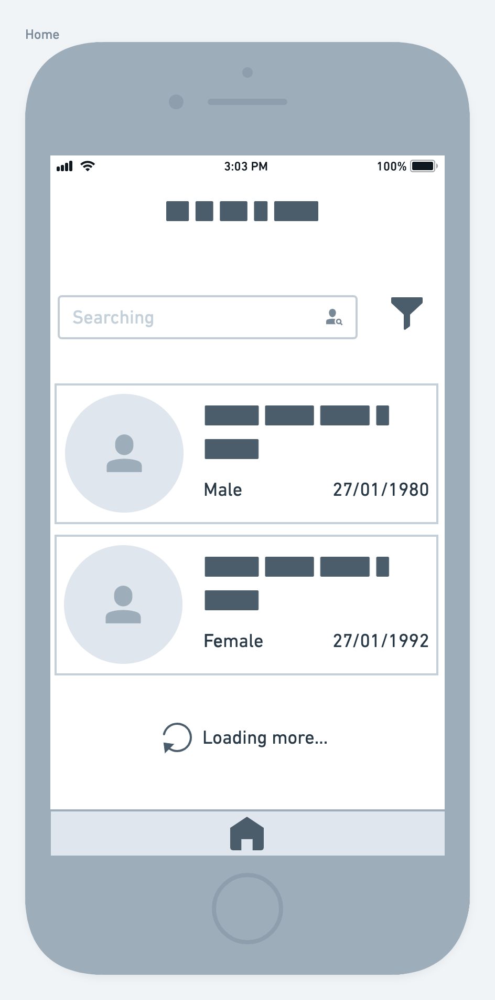
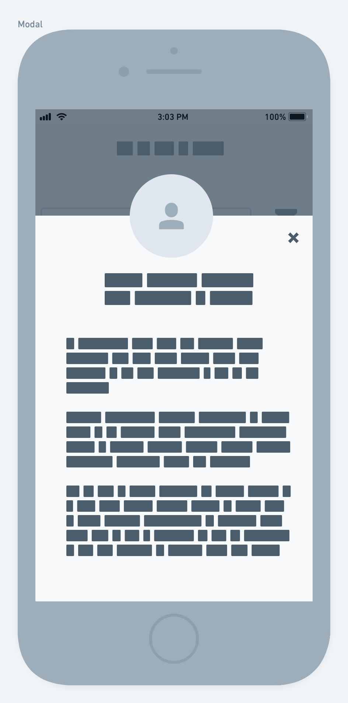

# Mobile Challenge 🏅 2021

## Introdução

Este é um desafio para testar seus conhecimentos de Mobile;

O objetivo é avaliar a sua forma de estruturação e autonomia em decisões para construir algo escalável utilizando um framework moderno.

Você está livre para usar **Android Kotlin** ou **Swift iOS** ou **Flutter** ou **React Native** ou **Ionic** no desenvolvimento da solução deste tech challenge.

[SPOILER] As instruções de entrega e apresentação do challenge estão no final deste Readme (=

## Case

A empresa Pharma Inc, está trabalhando em um projeto em colaboração com sua base de clientes para facilitar a gestão e visualização da informação dos seus pacientes de maneira simples e objetiva em uma aplicação onde podem listar, filtrar e expandir os dados disponíveis.
O seu objetivo nesse projeto, é trabalhar no desenvolvimento da Aplicação end que consumirá a API da empresa Pharma Inc seguindo os requisitos propostos neste desafio.

## Recursos

1. Estudar a documentação da REST API: https://randomuser.me/documentation
2. Trabalhar em um [FORK](https://lab.coodesh.com/help/gitlab-basics/fork-project.md) deste repositório em seu usuário ou utilizar um repositório em seu github pessoal (não esqueça de colocar no readme a referência a este challenge);
3. Logo da Marca: [Pharma Inc](assets/logo.png)
4. Cores para trabalhar no Projeto: [UI Colors](assets/colors.png)
5. [Wireframe](assets/screens.png) com as 3 telas principais.

## Lista de Pacientes

A tela inicial do projeto será um lista de pacientes que deverá conter um buscador para facilitar filtrar todos os que são exibidos na lista, proposta:



Para obter os dados, utilizaremos a API do Random User:

- https://randomuser.me/api/

Exemplo da resposta:

```json
{
   "results": [
       {
           "gender": "female",
           "name": {
               "title": "Ms",
               "first": "Alea",
               "last": "Christoffersen"
           }
       }
   ],
   "info": {
       "seed": "2f10116f1799d353",
       "results": 1,
       "page": 1,
       "version": "1.3"
   }
}
```

Além de realizar a request, devemos aplicar alguns filtros na API:

- Limitar em 50 resultados por request
- Utilizar o `Loading more` para indicar que estamos carregando mais dados da API

### Visualizar paciente

Para expandir a informação dos pacientes, teremos que adicionar o card como clicavél. Seguir o modelo proposto para o modal:



Devemos exibir os seguintes campos do paciente:

- Imagem
- Nome completo
- Email
- Gênero
- Data de nascimento
- Telefone
- Nacionalidade
- Endereço
- ID (Número de identificação)

## Extras

Além do desafio proposto com as duas telas, temos alguns diferenciais:

- **Diferencial 1** Adicionar um filtro por Gênero na tabela;
- **Diferencial 2** Configurar o buscador para poder filtrar por nacionalidade;
- **Diferencial 3** Escrever Unit Tests na Lista de Pacientes. Escolher a melhor abordagem e biblioteca;

## Readme do Repositório

- Deve conter o título do projeto
- Uma descrição sobre o projeto em frase
- Deve conter uma lista com linguagem, framework e/ou tecnologias usadas
- Como instalar e usar o projeto (instruções)
- Não esqueça o [.gitignore](https://www.toptal.com/developers/gitignore)
- Se está usando github pessoal, referencie que é um challenge by coodesh

## Finalização e Instruções para a Apresentação

Avisar sobre a finalização e enviar para correção.

1. Confira se respondeu o Scorecard Front-end;
2. Verique se o Readme está bom e faça o commit final em seu repositório;
3. Acesse: [https://coodesh.com/review-challenge](https://coodesh.com/review-challenge);
4. Coloque seu nome completo;
5. Coloque seu e-mail;
6. Adicione o repositório com a sua solução;
7. Confira a vaga desejada;


8. Envie e aguarde as instruções para apresentação da sua solução

## Instruções para se preparar para a Apresentação:

1. Aguarde o e-mail com as instruções de apresentação
2. Enquanto isso, crie uma conta na plataforma: https://www.loom.com/ e instale o Desktop App ou Extensão no Chrome: https://www.loom.com/download
3. DICA: Será necessário compartilhar a tela durante a gravação ou vídeo chamada. Deixe todos os projetos de solução previamente abertos em seu computador antes de iniciar a gravação ou chamanda de vídeo. Ambientes configurados e prontos para rodar.
4. Prepara-se pois você será questionado sobre cada etapa e decisão do Challenge. Prepare uma lista de perguntas, dúvidas, sugestões de melhorias e feedbacks (caso tenha).

## Suporte

Use o nosso canal no slack: http://bit.ly/32CuOMy para tirar dúvidas sobre o processo ou envie um e-mail para contato@coodesh.com.

